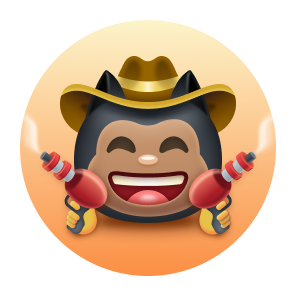
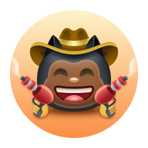
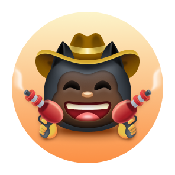

# 🏆 GitHub Achievements 🏆

  <picture>
    <source media="(prefers-color-scheme: light)" srcset="https://user-images.githubusercontent.com/65187002/172940015-d9d072e7-c47d-4ddd-83f6-8e7717a721b8.png">
    
  </picture>
   
  <picture>
    <source media="(prefers-color-scheme: light)" srcset="https://user-images.githubusercontent.com/65187002/172941127-4061fac1-736b-4c24-b7ea-c210b3578cc5.png">
    
  </picture>

---

## About This Repository

This repository contains a comprehensive collection of GitHub achievement badges and highlights. Whether you're looking to understand what achievements are available, how to earn them, or simply want to see all the different badge variations, you've come to the right place!

**Created by:** [Janith Suraweera](https://github.com/janithsuraweera)

---

## 🏅 Displaying Achievements

Displaying achievements on your GitHub profile is completely optional. By default, when you earn an achievement, it will be visible to anyone who views your public profile. If you prefer to keep your achievements private, you can opt out by going to your [profile settings](https://github.com/settings) and adjusting the visibility settings there.

---

## 📃 Complete Achievement List

Here's a detailed breakdown of all the achievements you can earn on GitHub, along with the requirements for each tier:

| Badge | Name | How to Get | Required Amount |
| :-: | :-: | :-: | :-: |
|  | **Heart On Your Sleeve** | Information coming soon | <table>  <thead>  <tr>  <th>DEFAULT</th> <th>BRONZE</th>  <th>SILVER</th>  <th>GOLD</th>  </tr>  </thead>  <tbody>  <tr>  <td align="center"></td>   <td></td>  <td></td>  <td></td>  </tr>  <tr>  <td align="center">(?)</td>  <td align="center">(?)</td>  <td align="center">(?)</td>  <td align="center">(?)</td>  </tr>   </tbody>  </table> |
|  | **Open Sourcerer** | Information coming soon | <table>  <thead>  <tr>  <th>DEFAULT</th> <th>BRONZE</th>  <th>SILVER</th>  <th>GOLD</th>  </tr>  </thead>  <tbody>  <tr>  <td align="center"></td>   <td></td>  <td></td>  <td></td>  </tr>  <tr>  <td align="center">(?)</td>  <td align="center">(?)</td>  <td align="center">(?)</td>  <td align="center">(?)</td>  </tr>   </tbody>  </table> |
|  | **Starstruck** | Create a repository that receives many stars from the community | <table>  <thead>  <tr>  <th>DEFAULT</th> <th>BRONZE</th>  <th>SILVER</th>  <th>GOLD</th>  </tr>  </thead>  <tbody>  <tr>  <td align="center"></td>   <td></td>  <td></td>  <td></td>  </tr>  <tr>  <td align="center">16 stars</td>  <td align="center">128 stars</td>  <td align="center">512 stars</td>  <td align="center">4096 stars</td>  </tr>   </tbody>  </table> |
|  | **Quickdraw** | Close an issue or pull request within 5 minutes of opening it | <table>  <thead>  <tr>  <th>DEFAULT</th>  </tr>  </thead>  <tbody>  <tr>  <td></td> </tr>  <tr>  <td align="center">1 time</td> </tr>   </tbody>  </table> |
|  | **Pair Extraordinaire** | [Coauthor](https://docs.github.com/pull-requests/committing-changes-to-your-project/creating-and-editing-commits/creating-a-commit-with-multiple-authors) commits on merged pull requests | <table>  <thead>  <tr>  <th>DEFAULT</th> <th>BRONZE</th>  <th>SILVER</th>  <th>GOLD</th>  </tr>  </thead>  <tbody>  <tr>  <td align="center"></td>   <td></td>  <td></td>  <td></td>  </tr>  <tr>  <td align="center">1 coauthored commit</td>  <td align="center">10 coauthored commits</td>  <td align="center">24 coauthored commits</td>  <td align="center">48 coauthored commits</td>  </tr>   </tbody>  </table> |
|  | **Pull Shark** | Open a pull request that gets merged into the main branch | <table>  <thead>  <tr>  <th>DEFAULT</th> <th>BRONZE</th>  <th>SILVER</th>  <th>GOLD</th>  </tr>  </thead>  <tbody>  <tr>  <td align="center"></td>   <td></td>  <td></td>  <td></td>  </tr>  <tr>  <td align="center">2 merged PRs</td>  <td align="center">16 merged PRs</td>  <td align="center">128 merged PRs</td>  <td align="center">1024 merged PRs</td>  </tr>   </tbody>  </table> |
|  | **Galaxy Brain** | Answer a discussion and have your answer accepted as the solution | <table>  <thead>  <tr>  <th>DEFAULT</th> <th>BRONZE</th>  <th>SILVER</th>  <th>GOLD</th>  </tr>  </thead>  <tbody>  <tr>  <td></td>  <td></td>  <td></td>  <td></td>  </tr>  <tr>  <td align="center">2 accepted answers</td> <td align="center">8 accepted answers</td>  <td align="center">16 accepted answers</td>  <td align="center">32 accepted answers</td>  </tr>   </tbody>  </table> |
|  | **YOLO** | Merge a pull request without having it reviewed first | <table>  <thead>  <tr>  <th>DEFAULT</th>  </tr>  </thead>  <tbody>  <tr>  <td></td> </tr>  <tr>  <td align="center">1 time</td> </tr>   </tbody>  </table> |
|  | **Public Sponsor** | Sponsor an open source contributor through [GitHub Sponsors](https://github.com/sponsors) | <table>  <thead>  <tr>  <th>DEFAULT</th>  </tr>  </thead>  <tbody>  <tr>  <td></td> </tr>  <tr>  <td align="center">1 sponsorship</td> </tr>   </tbody>  </table> |

---

## 👋 Achievement Skin Tone Variations

Some achievements have different appearances based on your emoji skin tone preference. This allows the badges to better reflect your personal preferences. You can change your preferred skin tone by going to your [appearance settings](https://github.com/settings/appearance) on GitHub.

| Badge | Name | Skin Tone Versions |
| :-: | :-: | :-: |
|  | **Starstruck** | <table>  <thead>  <tr>  <th>👋</th> <th>👋🏻</th>  <th>👋🏼</th>  <th>👋🏽</th>  <th>👋🏾</th>  <th>👋🏿</th>  </tr>  </thead>  <tbody>  <tr>  <td align="center"></td>   <td align="center"></td>  <td align="center"></td>  <td align="center"></td>  <td align="center"></td>   <td align="center"></td>   </tr>   <tr>  <td align="center">👋</td> <td align="center">👋🏻</td>  <td align="center">👋🏼</td>  <td align="center">👋🏽</td>  <td align="center">👋🏾</td>  <td align="center">👋🏿</td>  </tr>  </tbody>  </table> |
|  | **Quickdraw** | <table>  <thead>  <tr>  <th>👋</th> <th>👋🏻</th>  <th>👋🏼</th>  <th>👋🏽</th>  <th>👋🏾</th>  <th>👋🏿</th>  </tr>  </thead>  <tbody>  <tr>  <td align="center"></td>   <td align="center"></td>  <td align="center"></td>  <td align="center"></td>  <td align="center"></td>   <td align="center"></td>   </tr>   <tr>  <td align="center">👋</td> <td align="center">👋🏻</td>  <td align="center">👋🏼</td>  <td align="center">👋🏽</td>  <td align="center">👋🏾</td>  <td align="center">👋🏿</td>  </tr>  </tbody>  </table> |

---

## ✨ Highlights Badges

Highlights badges are special badges that showcase your participation in various GitHub programs and initiatives. These badges appear on your profile to highlight your involvement in the GitHub community.

| Badge | Name | How to Get |
| :-: | :-: | :-: |
|   | **Pro** | Use [GitHub Pro](https://docs.github.com/en/get-started/learning-about-github/githubs-products#github-pro) |
|  | **Developer Program Member** | Be a registered member of the [GitHub Developer Program](https://docs.github.com/en/developers/overview/github-developer-program) |
|  | **Security Bug Bounty Hunter** | Help hunt down security vulnerabilities at [GitHub Security](https://bounty.github.com/) |
|  | **GitHub Campus Expert** | Participate in the [GitHub Campus Program](https://education.github.com/experts) |
|  | **Security Advisory Credit** | Have your security advisory submitted to the [GitHub Advisory Database](https://github.com/advisories) accepted |

---

## ❌ Badges No Longer Earnable

These badges were part of special events or programs that have since ended. If you earned one of these badges during the active period, congratulations! They're now considered rare achievements.

| Badge | Name | How to Get | Required Amount |
| :-: | :-: | :-: | :-: |
|  | **Mars 2020 Contributor** | Contributed code to a repository used in the [Mars 2020 Helicopter Mission](https://github.com/readme/featured/nasa-ingenuity-helicopter) | <table>  <thead>  <tr>  <th>DEFAULT</th>  </tr>  </thead>  <tbody>  <tr>  <td></td> </tr>  <tr>  <td align="center">1 contribution</td> </tr>   </tbody>  </table> |
|  | **Arctic Code Vault Contributor** | Contributed code to a repository in the [2020 GitHub Archive Program](https://archiveprogram.github.com/) | <table>  <thead>  <tr>  <th>DEFAULT</th>  </tr>  </thead>  <tbody>  <tr>  <td></td> </tr>  <tr>  <td align="center">1 contribution</td> </tr>   </tbody>  </table> |

---

## ℹ️ More Information

For more detailed information about GitHub badges and how they work, check out the official GitHub documentation on [displaying badges on your profile](https://docs.github.com/en/account-and-profile/setting-up-and-managing-your-github-profile/customizing-your-profile/personalizing-your-profile#displaying-badges-on-your-profile).

---

  

---

**Repository maintained by:** [Janith Suraweera](https://github.com/janithsuraweera)
